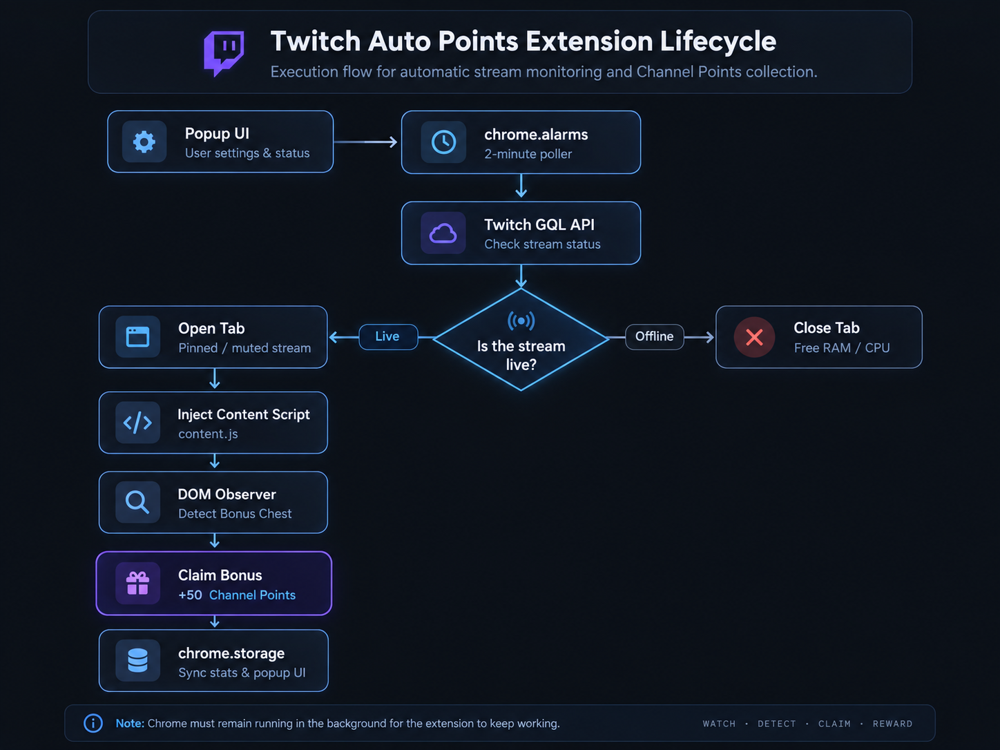

# Twitch Auto Watcher

[English](README.md) | [繁體中文](README.zh-TW.md)

A Chrome Manifest V3 extension that monitors one Twitch channel, automatically opens the stream when it goes live, keeps the managed stream tab running in the background, and automatically claims available Channel Points bonus rewards.

> Unofficial project. This project is not affiliated with, endorsed by, or sponsored by Twitch.



## Current Version

**v0.1.2**

## Features

- Monitor one Twitch channel automatically
- Check stream status every **2 minutes**
- Detect `LIVE` / `OFFLINE` using the Twitch Helix API
- Connect a Twitch account through Twitch device authorization
- Restore the saved Twitch session after Chrome restarts
- Validate the Twitch access token periodically
- Refresh expired access tokens automatically with the stored refresh token
- Save the monitored channel across browser restarts
- Accept either a Twitch login name or a full Twitch channel URL
- **Auto Watch** toggle
- **Auto Claim** toggle
- Open the configured stream automatically when it goes live
- Open the managed stream as a **pinned**, **muted** background tab
- Keep the managed tab from being automatically discarded where supported
- Detect discarded / frozen managed tabs and reload them when necessary
- Attempt to resume playback if the Twitch player becomes paused
- Close only the extension-managed stream tab when the channel goes offline
- Detect Channel Points bonus claim controls with DOM observation
- Periodically rescan as a fallback for Twitch UI changes
- Record claim actions locally
- Display account, stream status, watched channel, claim count, and last claim time in the popup
- Disconnect the saved Twitch API session from the popup

## How It Works

```text
Chrome is running
      |
      v
chrome.alarms wakes the background worker
      |
      v
Check configured Twitch channel
      |
      +--------------------+
      |                    |
      v                    v
    LIVE                 OFFLINE
      |                    |
      v                    v
Auto Watch enabled?    Close managed tab
      |
      +----------+
      |          |
     Yes         No
      |          |
      v          v
Open / reuse   Status only
managed tab
      |
      v
Pinned + muted + tab health checks
      |
      v
Content script watches Twitch DOM
      |
      v
Auto Claim enabled?
      |
      +----------+
      |          |
     Yes         No
      |          |
      v          v
Claim bonus    Do nothing
```

## Requirements

- Google Chrome or a compatible Chromium-based browser with Manifest V3 support
- A Twitch account
- The browser must already be signed in to Twitch for website-based viewing and Channel Points behavior
- Chrome must remain running for scheduled monitoring and automatic watching to continue

If Chrome is completely closed, the extension cannot monitor streams or keep a Twitch page playing.

## Installation

### Option 1: Clone with Git

```bash
git clone https://github.com/kent696/Twitch-Auto-Watcher.git
```

### Option 2: Download ZIP

Download the repository ZIP from GitHub and extract it.

Then:

1. Open Chrome.
2. Go to:

   ```text
   chrome://extensions
   ```

3. Enable **Developer mode**.
4. Click **Load unpacked**.
5. Select the project folder that contains `manifest.json`.
6. Pin **Twitch Points Watcher** from the Chrome extensions menu if desired.

## First-Time Setup

1. Open the extension popup.
2. Click **Connect Twitch**.
3. Complete the Twitch authorization flow in the tab that opens.
4. Enter the Twitch channel you want to monitor.

You can enter a login name:

```text
dasoku_aniki
```

or a full URL:

```text
https://www.twitch.tv/dasoku_aniki
```

The extension normalizes the value to the Twitch login name.

5. Click **Save Channel**.

Saving the channel also triggers an immediate stream-status check.

## Popup Controls

### Twitch Account

Shows whether a Twitch API session is connected.

Available actions:

- `Connect Twitch`
- `Disconnect Twitch`

### Twitch Channel

Sets the single channel that the extension monitors.

### Auto Watch

When enabled:

- A live stream opens automatically
- The managed tab is pinned
- The managed tab is muted
- The extension tries to keep playback running
- The tab is monitored for discard / freeze conditions
- The managed tab closes automatically when the channel goes offline

When disabled:

- Stream status monitoring continues
- The extension does not keep an automatic viewing tab open

### Auto Claim

When enabled, the content script attempts to click available Channel Points bonus claim controls on the extension-managed Twitch channel page.

When disabled, the content script does not claim bonuses.

> If Auto Watch is disabled, there is normally no extension-managed stream page for Auto Claim to operate on.

## Popup Status

The popup currently displays:

```text
Twitch Account
Connected / Not connected

Channel
configured_channel

Automation
Auto Watch
Auto Claim

Stream Status
LIVE / OFFLINE / Unknown

Watching
managed_channel

Claims
claim_count

Last Claim
date / time
```

## Channel Points Claiming

The current implementation:

- Observes Twitch DOM changes with `MutationObserver`
- Looks for known Channel Points bonus claim controls
- Uses a periodic scan as a fallback
- Prevents very rapid duplicate clicks
- Records a claim event after the extension triggers the claim action

The displayed **Claims** value is a count of claim actions recorded by the extension. It is **not** a calculation of your total Twitch Channel Points balance.

Twitch can change its frontend markup at any time, so the claim detector may require maintenance in future versions.

## Background Reliability

This project uses Manifest V3, so its background service worker is not expected to remain alive continuously.

Instead, it uses `chrome.alarms`:

- Stream check: every **2 minutes**
- Twitch token validation: every **60 minutes**
- Device authorization polling while connecting: approximately every **30 seconds**

For the managed Twitch tab, the extension also:

- Sets `pinned: true`
- Sets `muted: true`
- Sets `autoDiscardable: false`
- Checks `discarded`
- Checks `frozen`
- Reloads the managed tab when recovery is needed

This reduces the chance of background viewing being interrupted by browser tab lifecycle management, but it cannot override every operating-system or browser resource policy.

## Twitch Authentication

The extension uses a Twitch **Public Client** style flow and stores the returned session data locally.

Saved values include:

```text
twitchAccessToken
twitchRefreshToken
twitchLogin
twitchUserId
twitchScopes
twitchTokenExpiresAt
```

On startup, the extension validates the saved access token. If the access token is no longer valid and a refresh token is available, it attempts to refresh the Twitch session automatically.

### For Forks

If you maintain your own fork or deployment, register your own Twitch Developer Application and update:

```javascript
const TWITCH_CLIENT_ID = "YOUR_CLIENT_ID";
```

in:

```text
src/background/background.js
```

Do **not** commit a Client Secret, access token, refresh token, or private OAuth data to GitHub.

## Local Data

The extension uses:

```text
chrome.storage.local
```

for settings and runtime state.

Examples:

```text
channel
autoWatchEnabled
autoClaimEnabled
twitchAccessToken
twitchRefreshToken
twitchLogin
twitchUserId
streamStatus
streamInfo
watchTabId
watchingChannel
claimStats
totalClaimCount
lastClaimAt
lastClaimChannel
```

This version does not use a project-owned backend server to store those values.

## Permissions

`manifest.json` currently requests:

```text
storage
alarms
tabs
```

Host access:

```text
https://www.twitch.tv/*
https://api.twitch.tv/*
https://id.twitch.tv/*
```

These are used for local settings, scheduled checks, managed Twitch tabs, Twitch API requests, and Twitch authentication.

## Project Structure

```text
Twitch Auto Watcher/
├─ manifest.json
├─ README.md
├─ README.zh-TW.md
├─ LICENSE
└─ src/
   ├─ assets/
   │  └─ icons/
   ├─ background/
   │  └─ background.js
   ├─ content/
   │  └─ content.js
   ├─ docs/
   │  ├─ flowchart-en.png
   │  └─ flowchart-zh-TW.png
   ├─ popup/
   │  ├─ popup.html
   │  ├─ popup.css
   │  └─ popup.js
   └─ utils/
      ├─ storage.js
      ├─ tabs.js
      └─ twitch.js
```

## Main Components

### `src/background/background.js`

Responsible for:

- Twitch device authorization
- Access-token validation
- Refresh-token rotation / renewal
- Session restore after Chrome restarts
- Stream-status polling
- Auto Watch settings
- Managed-tab creation and cleanup
- Managed-tab health checks
- Claim-event statistics
- Popup / content-script message handling

### `src/content/content.js`

Responsible for:

- Detecting the managed Twitch channel page
- Observing Twitch DOM changes
- Finding bonus claim controls
- Respecting the Auto Claim setting
- Triggering claim actions
- Attempting to keep the video player running

### `src/popup/`

Responsible for:

- Twitch account status
- Channel configuration
- Auto Watch / Auto Claim controls
- LIVE / OFFLINE status
- Watching status
- Claim statistics

## Current Limitations

- Only one Twitch channel can be monitored at a time
- Stream polling interval is currently fixed at 2 minutes
- There is no dedicated manual **Check Now** button in the popup
- Claim statistics count recorded claim actions, not the exact number of Channel Points earned
- Twitch frontend changes can break DOM-based bonus detection
- Chrome must remain running
- Browser / OS resource-saving behavior can still interrupt background media in some environments

## Roadmap

Possible future improvements:

- Configurable stream check interval
- Manual **Check Now** button
- Multi-channel monitoring
- Channel priority rules
- More detailed claim history
- Better error / connection diagnostics
- Notification options
- Release packaging and versioned GitHub Releases

## Version History

### v0.1.2

- Added Auto Watch ON / OFF
- Added Auto Claim ON / OFF
- Added popup automation controls
- Preserved Twitch session and channel settings across Chrome restarts
- Added token validation and automatic token refresh
- Added managed-tab anti-discard / health checks
- Added discarded / frozen tab recovery
- Improved popup status and claim statistics

## Development Status

This project is still under active development.

## Security Notes

Never commit:

```text
Client Secret
Access Token
Refresh Token
Authorization codes
Private OAuth data
```

The Twitch Client ID is an application identifier and may be present in a public client build.

## Disclaimer

This project is intended for development, learning, and personal-use experimentation.

Twitch controls stream availability, Channel Points eligibility, earning rules, and website behavior. Users are responsible for checking whether their use of this extension complies with Twitch's current Terms of Service, developer policies, and other applicable rules.

## License

This project is licensed under the MIT License.

See [LICENSE](LICENSE) for details.