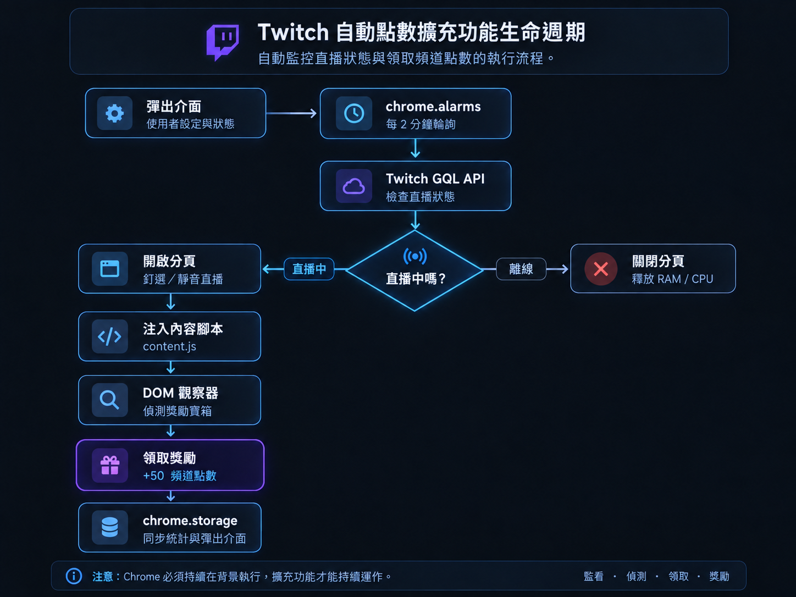

# Twitch Auto Watcher

[English](README.md) | [繁體中文](README.zh-TW.md)

這是一個使用 Chrome Manifest V3 製作的 Twitch 自動觀看擴充功能，可以監控指定頻道，在頻道開台時自動開啟直播、維持背景觀看，並自動領取可用的 Channel Points Bonus。

> 本專案為非官方專案，與 Twitch 無隸屬、合作、贊助或背書關係。



## 目前版本

**v0.1.2**

## 功能

- 自動監控一個 Twitch 頻道
- 每 **2 分鐘**檢查一次直播狀態
- 透過 Twitch Helix API 判斷 `LIVE` / `OFFLINE`
- 使用 Twitch 裝置授權流程連接 Twitch 帳號
- Chrome 重開後自動恢復已儲存的 Twitch Session
- 定期驗證 Twitch Access Token
- Access Token 失效時自動使用 Refresh Token 更新
- Chrome 重開後保留監控頻道
- 可直接輸入 Twitch Login Name 或完整頻道網址
- **Auto Watch** ON / OFF
- **Auto Claim** ON / OFF
- 頻道開台時自動開啟直播
- 自動觀看分頁會設為**釘選**、**靜音**
- 在支援的情況下避免 Chrome 自動丟棄自動觀看分頁
- 偵測自動觀看分頁是否被 discarded / frozen，必要時重新載入
- Twitch 播放器意外暫停時嘗試恢復播放
- 頻道下播後只關閉 Extension 自己建立的直播分頁
- 使用 DOM Observer 偵測 Channel Points Bonus
- 額外使用定時掃描作為 Twitch UI 變動時的 fallback
- 在本機記錄 Bonus 領取動作
- Popup 顯示 Twitch 帳號、直播狀態、觀看頻道、領取次數與最後領取時間
- 可從 Popup 解除 Twitch API Session

## 運作流程

```text
Chrome 保持執行
      |
      v
chrome.alarms 喚醒 Background Worker
      |
      v
檢查設定的 Twitch 頻道
      |
      +--------------------+
      |                    |
      v                    v
    LIVE                 OFFLINE
      |                    |
      v                    v
Auto Watch 開啟？       關閉自動觀看分頁
      |
      +----------+
      |          |
     是          否
      |          |
      v          v
開啟 / 重用     只更新直播狀態
自動觀看分頁
      |
      v
釘選 + 靜音 + 分頁健康檢查
      |
      v
Content Script 監控 Twitch DOM
      |
      v
Auto Claim 開啟？
      |
      +----------+
      |          |
     是          否
      |          |
      v          v
自動領取 Bonus   不執行領取
```

## 使用需求

- Google Chrome 或相容的 Chromium 瀏覽器
- 支援 Manifest V3
- Twitch 帳號
- 瀏覽器內需要已登入 Twitch，才能正常使用網站端觀看與 Channel Points 功能
- Chrome 必須保持執行，自動監控與自動觀看才能持續

如果 Chrome 被完全關閉，Extension 就無法繼續檢查直播或維持 Twitch 分頁播放。

## 安裝方式

### 方法一：使用 Git Clone

```bash
git clone https://github.com/kent696/Twitch-Auto-Watcher.git
```

### 方法二：下載 ZIP

從 GitHub 下載 Repository ZIP 並解壓縮。

接著：

1. 開啟 Chrome。
2. 前往：

   ```text
   chrome://extensions
   ```

3. 開啟右上角的 **開發人員模式**。
4. 點擊 **載入未封裝項目**。
5. 選擇包含 `manifest.json` 的專案資料夾。
6. 如有需要，可以把 `Twitch Points Watcher` 固定到 Chrome 工具列。

## 第一次使用

1. 打開 Extension Popup。
2. 點擊 **Connect Twitch**。
3. 在自動開啟的 Twitch 頁面完成授權。
4. 輸入要監控的 Twitch 頻道。

可以輸入 Login Name：

```text
dasoku_aniki
```

也可以直接貼完整網址：

```text
https://www.twitch.tv/dasoku_aniki
```

Extension 會自動整理成 Twitch Login Name。

5. 點擊 **Save Channel**。

儲存頻道後會立即執行一次直播狀態檢查，不需要等待下一個 2 分鐘排程。

## Popup 功能

### Twitch Account

顯示 Twitch API Session 是否已連接。

可使用：

- `Connect Twitch`
- `Disconnect Twitch`

### Twitch Channel

設定目前唯一要監控的 Twitch 頻道。

### Auto Watch

開啟後：

- 頻道 LIVE 時自動打開直播
- 將自動觀看分頁設為釘選
- 將分頁設為靜音
- 嘗試維持 Twitch 播放器播放
- 定期檢查分頁是否被 discard / freeze
- 頻道 OFFLINE 後自動關閉 Extension 管理的直播分頁

關閉後：

- LIVE / OFFLINE 狀態仍然會持續監控
- 不會保留自動觀看 Twitch 分頁

### Auto Claim

開啟後，Content Script 會在 Extension 管理的 Twitch 頻道頁面中尋找可領取的 Channel Points Bonus，並嘗試自動點擊。

關閉後不會自動領取 Bonus。

> 如果 Auto Watch 關閉，通常不會存在 Extension 管理的直播頁面，因此 Auto Claim 也沒有頁面可以執行自動領取。

## Popup 狀態

目前 Popup 會顯示：

```text
Twitch Account
Connected / Not connected

Channel
configured_channel

Automation
Auto Watch
Auto Claim

Stream Status
LIVE / OFFLINE / Unknown

Watching
managed_channel

Claims
claim_count

Last Claim
日期 / 時間
```

## Channel Points 自動領取

目前版本會：

- 使用 `MutationObserver` 監控 Twitch DOM
- 尋找已知的 Channel Points Bonus Claim 元素
- 使用定時掃描作為 fallback
- 避免短時間內重複點擊同一個 Bonus
- Extension 觸發領取動作後記錄一次 Claim Event

Popup 顯示的 **Claims** 是 Extension 記錄到的「領取動作次數」，不是 Twitch 帳號目前的 Channel Points 總餘額，也不是精確計算實際獲得多少點數。

Twitch 未來可能調整前端 HTML / DOM 結構，因此自動領取邏輯可能需要跟著維護。

## Background 穩定性

本專案使用 Manifest V3，所以 Background Service Worker 不會永久常駐。

目前透過 `chrome.alarms` 執行：

- 直播檢查：每 **2 分鐘**
- Twitch Token 驗證：每 **60 分鐘**
- Twitch 授權期間的 Device Code 輪詢：約每 **30 秒**

針對自動觀看 Twitch 分頁，目前還會：

- 設定 `pinned: true`
- 設定 `muted: true`
- 設定 `autoDiscardable: false`
- 檢查 `discarded`
- 檢查 `frozen`
- 必要時重新載入自動觀看分頁

這些機制可以降低 Chrome 背景分頁生命週期管理造成的中斷，但無法完全繞過所有瀏覽器或作業系統的資源管理策略。

## Twitch 登入與 Token

Extension 使用 Twitch Public Client 類型的授權方式，並把 Twitch Session 資料保存在使用者瀏覽器本機。

例如：

```text
twitchAccessToken
twitchRefreshToken
twitchLogin
twitchUserId
twitchScopes
twitchTokenExpiresAt
```

Chrome 啟動時會驗證保存的 Access Token。

如果 Access Token 已失效，但還存在 Refresh Token，Extension 會嘗試自動更新 Session，而不是直接要求重新登入。

### Fork / 自行部署

如果你 Fork 本專案或要建立自己的版本，建議自行註冊 Twitch Developer Application，並修改：

```javascript
const TWITCH_CLIENT_ID = "YOUR_CLIENT_ID";
```

位置：

```text
src/background/background.js
```

請勿將 Client Secret、Access Token、Refresh Token 或私人 OAuth 資料提交到 GitHub。

## 本機資料

Extension 使用：

```text
chrome.storage.local
```

儲存設定與執行狀態。

例如：

```text
channel
autoWatchEnabled
autoClaimEnabled
twitchAccessToken
twitchRefreshToken
twitchLogin
twitchUserId
streamStatus
streamInfo
watchTabId
watchingChannel
claimStats
totalClaimCount
lastClaimAt
lastClaimChannel
```

目前版本沒有使用本專案自己的後端伺服器保存上述資料。

## 權限

目前 `manifest.json` 使用：

```text
storage
alarms
tabs
```

Host 權限：

```text
https://www.twitch.tv/*
https://api.twitch.tv/*
https://id.twitch.tv/*
```

用途包括本機設定、排程檢查、自動觀看分頁管理、Twitch API 與 Twitch 授權。

## 專案結構

```text
Twitch Auto Watcher/
├─ manifest.json
├─ README.md
├─ README.zh-TW.md
├─ LICENSE
└─ src/
   ├─ assets/
   │  └─ icons/
   ├─ background/
   │  └─ background.js
   ├─ content/
   │  └─ content.js
   ├─ docs/
   │  ├─ flowchart-en.png
   │  └─ flowchart-zh-TW.png
   ├─ popup/
   │  ├─ popup.html
   │  ├─ popup.css
   │  └─ popup.js
   └─ utils/
      ├─ storage.js
      ├─ tabs.js
      └─ twitch.js
```

## 主要程式

### `src/background/background.js`

負責：

- Twitch Device Authorization
- Access Token 驗證
- Refresh Token 更新與保存
- Chrome 重開後恢復 Twitch Session
- 定期檢查 Twitch LIVE / OFFLINE
- Auto Watch 設定
- 自動建立與關閉 Twitch 分頁
- 自動觀看分頁健康檢查
- Claim Event 統計
- Popup / Content Script Message Handling

### `src/content/content.js`

負責：

- 判斷目前是否為 Extension 管理的 Twitch 頻道
- 監控 Twitch DOM
- 尋找 Channel Points Bonus
- 遵守 Auto Claim 設定
- 執行 Bonus 領取
- 嘗試維持 Twitch 播放器播放

### `src/popup/`

負責：

- Twitch 帳號狀態
- 監控頻道設定
- Auto Watch / Auto Claim 開關
- LIVE / OFFLINE 顯示
- Watching 狀態
- Claim 統計

## 目前限制

- 一次只能監控一個 Twitch 頻道
- 直播偵測時間目前固定為 2 分鐘
- Popup 目前沒有獨立的 **Check Now** 按鈕
- Claims 是領取動作紀錄，不是實際 Channel Points 數量
- Twitch 修改前端 DOM 後可能需要更新 Auto Claim 邏輯
- Chrome 必須保持執行
- 某些系統的省電或資源管理仍可能中斷背景媒體

## Roadmap

未來可以加入：

- 自訂直播偵測時間
- 手動 **Check Now**
- 多頻道監控
- 頻道優先順序
- 更完整的 Claim History
- 更完整的錯誤 / 連線診斷
- 通知功能
- GitHub Release 安裝包

## 版本紀錄

### v0.1.2

- 新增 Auto Watch ON / OFF
- 新增 Auto Claim ON / OFF
- 新增 Popup Automation 控制
- Chrome 重開後保留 Twitch Session 與監控頻道
- 新增 Token 驗證與自動 Refresh
- 新增自動觀看分頁 Anti-Discard / Health Check
- 新增 discarded / frozen 恢復機制
- 強化 Popup 狀態與 Claim 統計

## 開發狀態

本專案仍在持續開發中。

## 安全性

請勿將以下內容提交到 GitHub：

```text
Client Secret
Access Token
Refresh Token
Authorization Code
私人 OAuth 資料
```

Twitch Client ID 屬於應用程式識別資訊，可以存在 Public Client 的程式中。

## 免責聲明

本專案主要用於開發、學習與個人用途。

直播狀態、Channel Points 資格、點數取得規則以及 Twitch 網頁行為皆由 Twitch 控制。使用者需自行確認實際使用方式符合 Twitch 最新的 Terms of Service、Developer Policies 與其他適用規則。

## License

本專案採用 MIT License 授權。

詳細內容請參閱 [LICENSE](LICENSE)。